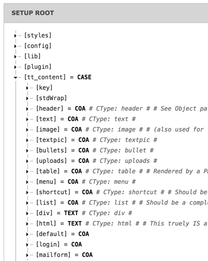

.. include:: ../../Includes.txt

.. _css-styled-content:

css\_styled\_content
^^^^^^^^^^^^^^^^^^^^

It would be tiresome to program this for every TYPO3 CMS installation,
because the elements are the same, or have very similar functionality.
For this reason, TYPO3 CMS offers "static templates", bundled into
system extension "css\_styled\_content". It has a
meaningful definition for every existing type of content element.

Usage is very easy. The definitions are available in a global TypoScript
object called :code:`tt_content`. In order to use it for our page,
we can just set:

.. code-block:: typoscript

   page.10.renderObj < tt_content

Actually the :code:`tt_content` object represents the default
rendering when grabbing content with a :ref:`CONTENT <t3tsref:cobj-content>`
object. So this assignment is not necessary.

So for every content element in TYPO3 CMS, there is a corresponding
definition in "css\_styled\_content". This is easily seen in the
TypoScript Object Browser:

It is easy to see which definition corresponds to which type of content
element. You can modify this base code if you want to change the rendering
for a given content element type. Let's say we want the "header" element
type to always render with :code:`<h1>` tags, no matter what options
where chosen by the user. We could write something like:

.. code-block:: typoscript

    # Because TYPO3 saves everything in one big array, the properties that are not overwritten
    # are preserved and could result in strange behavior. That is why all old properties should be deleted.
    tt_content.header >

    # Every header will be rendered with h1 tags, independently from the properties in the content element.
    tt_content.header = TEXT
    tt_content.header.stdWrap.wrap = <h1>|</h1>
    tt_content.header.stdWrap.field = header
