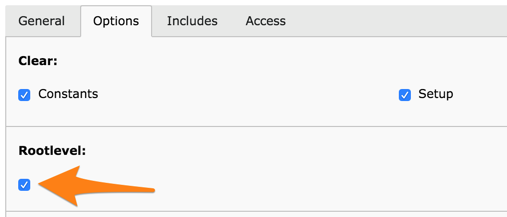

.. ==================================================
.. FOR YOUR INFORMATION
.. --------------------------------------------------
.. -*- coding: utf-8 -*- with BOM.

.. include:: ../../Includes.txt

.. _main-template:

The main template
^^^^^^^^^^^^^^^^^

The TypoScript code used to define how pages are rendered is
located in the "main" template. In this template the rootlevel flag is
set.

When the frontend renders a page, TYPO3 searches along the page tree up
to the root page to find a "main" template. Normally, there are
additional templates besides the "main" template (the template analyzer helps show how they work together).
For now, we will assume we are only using the "main" template.

TypoScript syntax is very straightforward. On the left side, objects
and properties are defined. Properties are assigned values, and both
objects and properties can contain other objects. Object properties
are defined by using the dot "." notation.

SUGGESTION: give an example for a newbie to understand the concept of dot notation.
page.10=???
