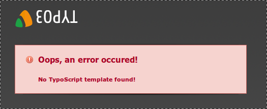
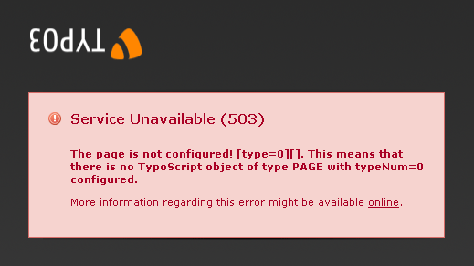

.. ==================================================
.. FOR YOUR INFORMATION
.. --------------------------------------------------
.. -*- coding: utf-8 -*- with BOM.

.. include:: ../../Includes.txt

.. _template:
.. _the-term-template:

The term template
^^^^^^^^^^^^^^^^^

The term template has a double meaning in TYPO3. On the one hand,
there is the *HTML template file*, which serves as the skeletal
structure in which the content, provided in TYPO3,
will be rendered. On the other hand, there is the *TypoScript
template*, which can be created in the template module in the TYPO3
Backend. A TypoScript template can be saved on any page.

Common mistakes made with TypoScript templates can cause a message like this:

"No TypoScript template found": This warning appears if no template, with the root level flag enabled,
is found in the page tree.

"The page is not configured": This warning appears, if the rootlevel
flag of a template in the page tree is enabled (so that this template
is used), but no PAGE Object can be found.

The following code is enough to remove this warning:

.. code-block:: typoscript

	page = PAGE
	page.10 = TEXT
	page.10.value = Hello World

