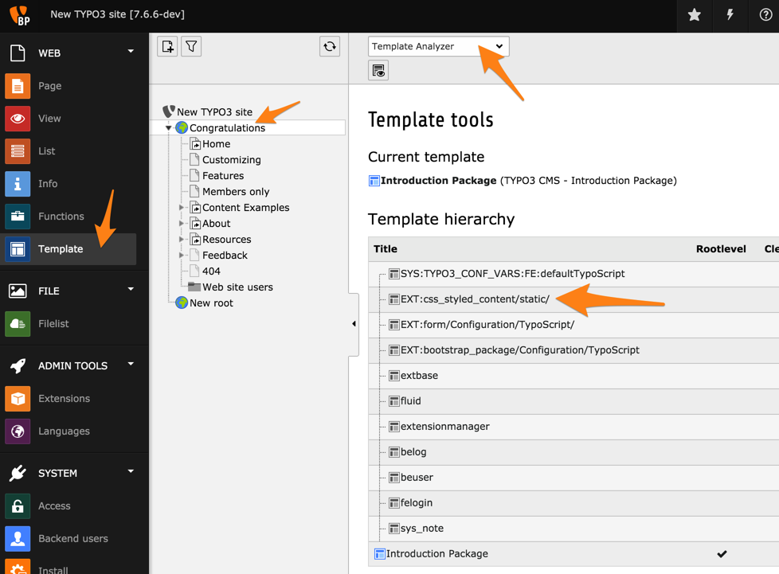

.. include:: ../Includes.txt

.. _using-css-styled-content:

Using css\_styled\_content
--------------------------

It is worth taking a deeper look at "css\_styled\_content".
It comes with more than 2000 lines of TypoScript code containing
definitions for each type of content element.

Although it may seem daunting, it is very instructive to review
all this code, as there is much to learn by example. To view
the raw code, place yourself on the root page of your web site
and move to the **WEB > Template** module. Then choose the
*Template Analyzer* function.

You should see a list of all used TypoScript templates and how they
possibly include one another. All templates are evaluated by TYPO3 CMS
from top to bottom.

With a click on "EXT:css\_styled\_content/static/", you can view
the content of that template (below the hierarchical view),
first the constants, then the setup (scroll down).

You will see that "css\_styled\_content" adds HTML elements with many
classes to the rendering of a page. They are used by TYPO3 CMS to display
things in a structured way, e.g. images at their selected position like
next to text, the link to top, etc. This also has the advantage that it
is not necessary to enter different classes by hand, if you want to
modify the styling. All you need is to find out which HTML element has
which class, and to add CSS styles for that class. Example:

.. code-block:: html

	
...

The names of the classes are mostly intuitive. The all start with :code`csc`
(which stands for "Css Styled Content"). In the example, this is followed by
:code:`textpic`, which stands for the TypoScript element
"textpic" (used to render content elements of type "text
& images"). Finally :code:`imagewrap` suggests that the :code:`
` container
wraps around an image.

What is happening in detail can be understood by making an empty page
with only one element, and then checking out the generated source code
of that page.

For example, headlines are normally enumerated so that the first
headline can be handled specifically. For HTML tables, the classes
"odd" and "even" are inserted so that it is easy to color table rows
differently. In the same manner, the table columns can be handled
individually.

HTML purists may find that "css\_styled\_content" generates too much markup.
It is perfectly possible to trim down this setup or write one's own entirely.
However this is not recommended for beginners.
